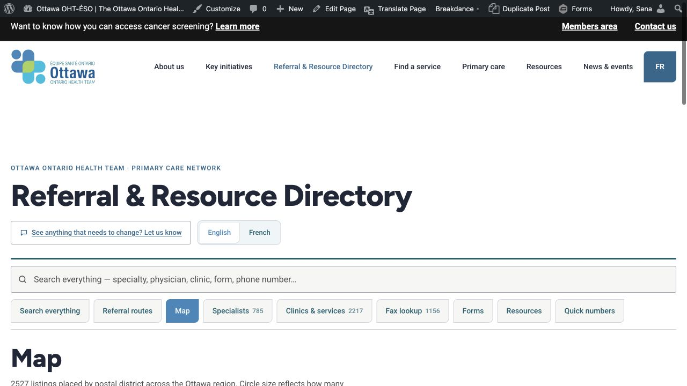
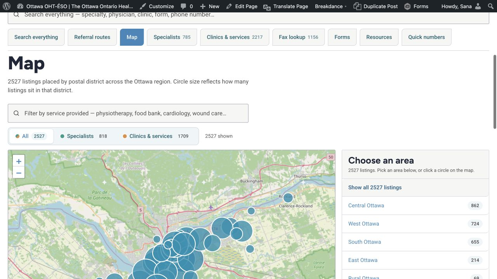

# Ottawa Primary Care Directory

Hybrid WordPress implementation of the Ottawa OHT-ÉSO **Referral & Resource
Directory**.

The active architecture deliberately separates content management from public
presentation:

- [Business Directory Plugin](https://wordpress.org/plugins/business-directory-plugin/)
  owns the 3,519 editable WordPress listings, categories, fields, permissions,
  and CSV import/export.
- `ottawa-primary-care-directory/` is a read-only presentation adapter that
  restores the purpose-built Ottawa directory interface while reading current
  published Business Directory records.
- Breakdance and the parent WordPress site supply the global header, footer,
  fonts, and design system.

## Current staging integration

- Business Directory Plugin: **6.4.26**, active with automatic updates enabled
- Ottawa Directory Presentation Adapter: **2.1.6**, active
- Public page shortcode: `[ottawa_primary_care_directory]`
- Public URL: `/business-directory/`
- Published WordPress listings: **3,519**
- Read-only presentation endpoint: `/wp-json/opcd/v1/directory`
- Production site: unchanged

## Public feature set

- Search Everything
- Referral Routes and central intake
- Complete map search across all 3,519 published records, with postal-district
  markers, service filtering, directions, and a separate transparent list for
  online, confidential-location, or addressless records
- Specialist roster with specialty and language filters
- Clinics/services with section, category, location, and OHT filters
- Fax lookup
- Forms
- Resources
- Quick numbers
- English/French interface controls
- Feedback/correction links
- Phone-format and accent-insensitive search
- Structured cards, tables, badges, verification notices, and mobile layouts

## Staging screenshots

The first image is the final hybrid directory. The second shows the restored
postal-district map. A screenshot of the temporary generic Business Directory
frontend is retained under `docs/screenshots/` for comparison.





## Repository map

- `DEVELOPER-HANDOFF.md` — architecture, responsibilities, and production handoff
- `PRODUCTION-RUNBOOK.md` — safe installation, acceptance, and rollback
- `STAGING-CHANGELOG.md` — exact staging changes and verification results
- `migration/business-directory-plugin/` — clean CSVs, admin guide, and API notes
- `ottawa-primary-care-directory/` — deployable read-only presentation adapter
- `tools/build-business-directory-import.py` — validated Business Directory CSV generator
- `tools/validate-wordpress-plugin.py` — presentation adapter structural validation

## Build and validation

```bash
python3 tools/build-business-directory-import.py
python3 tools/validate-wordpress-plugin.py
```

The clean CSV is only for an empty directory. For in-place bulk updates, first
export the target WordPress directory with Business Directory Plugin's own
generated `sequence_id` values, edit that export, and re-import it.

## Record totals

| Type | Published WordPress listings |
|---|---:|
| Specialists | 785 |
| Clinics & services | 2,217 |
| Referral routes | 49 |
| Central intakes | 9 |
| Forms | 7 |
| Resources | 435 |
| Quick numbers | 17 |
| **Total** | **3,519** |

The designed specialist roster has 819 specialty appearances for 785 unique
physicians because some physicians belong to multiple specialty groups. The
fax lookup contains 1,151 service fax entries plus five separately verified
intake/form destinations.

The Map tab searches all 3,519 published records. Of those, 2,582 have a
supported public postal location and appear in district markers; 937 remain
searchable under **records without a public map location**. This avoids both
missing resources and inventing locations for confidential or online services.

## Maintenance boundary

The presentation adapter has no public write operations, user accounts,
payments, or custom database tables. It does contain site-specific PHP,
JavaScript, CSS, and locally bundled Leaflet 1.9.4. The production owner must
review that small presentation layer and its Leaflet dependency through the
normal managed-update and staging-test process.
